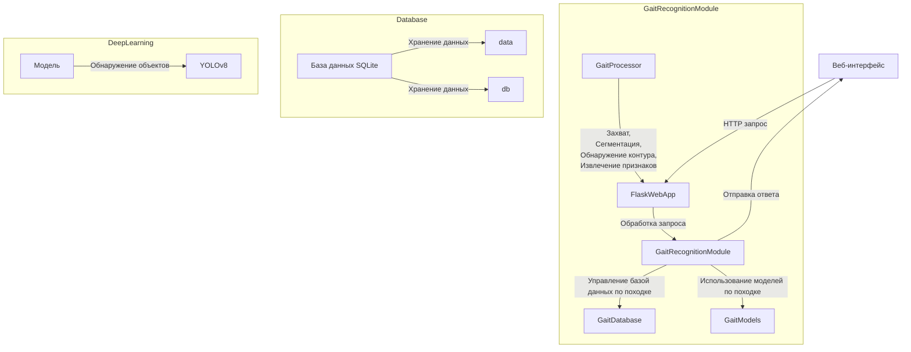

# MANUAL:

СКЛОНИРУЙТЕ репозиторий.

УСТАНОВИТЕ необходимые зависимости с помощью команды pip install -r requirements.txt (только с GPU).

ЗАГРУЗИТЕ [последнюю версию модели](https://github.com/jackhanyuan/GaitRecognitionSystem/releases/latest) и разархивируйте сжатый файл в папку `model/gait/output`.

Для выполнения предсказаний:
```
python main.py
```
Веб-доступ: http://localhost:5000/. 
Примечания: сначала завершите регистрацию походки и убедитесь, что видео в базе данных больше 0. Затем убедитесь, что на видео присутствует только один человек. Версия для нескольких человек будет обновлена ​​позже.


# Behavioral-biometrics
Идентификация личности на основе походки и смежных факторов в поведенческой биометрии

### Team:
- Kirill Sheshulin
- Kirill Zarubin
- Nikita Shubny
- Julia Solomennikowa

Визуальное наблюдение в цифровую эпоху взорвало рост устройств и систем безопасности. Идентификация личности на основе походки и лица - это развивающаяся биометрическая модальность для автоматического визуального наблюдения и мониторинга, поскольку образцы походки тесно коррелируют с личностью субъекта. Научные исследования по идентификации личности с использованием походки и низкоразрешенного лица резко выросли за последние два десятилетия из-за нескольких преимуществ. Это не требует активного сотрудничества пользователей и может выполняться без их согласия.

Программа идентификации лиц и лица предназначена для обнаружения и идентификации лиц на изображениях размером 30x30 пикселей с использованием суперразрешения изображений EDSR, в то время как идентификация по походке осуществляется на основе набора силуэтов (здесь НЕТ ОГРАНИЧЕНИЙ на ввод, что означает, что он может содержать любое количество несмежных силуэтов, снятых под разными углами обзора при разных условиях ходьбы).




