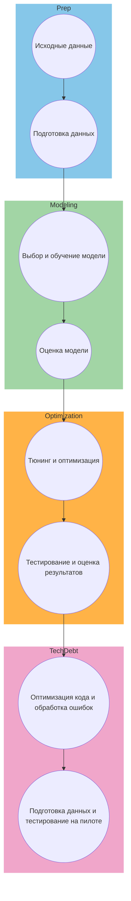

# ML System Design Doc - [RU]
## MVP - "Идентификация личности по походке и смежным факторам поведенческой биометрии" 


------------------------------------------------------------------------------------------------    
### 1. Цели и предпосылки 
#### 1.1. Зачем идем в разработку продукта?  

1. **Бизнес-цель Product Owner**: увеличение прибыли, расширение рынка, улучшение удовлетворенности клиенто, обеспечение конкурентного преимущества на рынке.
2. **Улучшение от использования ML Product Owner & Data Scientist**: Машинное обучение может помочь автоматизировать процессы аутентификации пользователей.
5. **Успех итерации с точки зрения бизнеса Product Owner**: увеичение количества верно идентифицированых личностей.
------------------------------------------------------------------------------------------------
#### 1.2. Бизнес-требования и ограничения  ####

- **Краткое описание БТ и ссылки на детальные документы с бизнес-требованиями** `Product Owner`
  - Бизнес-требования для данного проекта включают в себя разработку и внедрение системы идентификации личности на основе поведенческих биометрических данных, таких как походка и другие факторы поведения. Детальные бизнес-требования предоставлены Product Owner'ом в документе [ссылка на документ с бизнес-требованиями].

- **Бизнес-ограничения** `Product Owner`
  - Product Owner также предоставил список бизнес-ограничений, который включает в себя бюджетные ограничения, сроки реализации, конфиденциальность данных и законодательные требования. Детальное описание ограничений можно найти в документе [ссылка на документ с бизнес-ограничениями].

- **Ожидания от конкретной итерации** `Product Owner`
  - Product Owner ожидает, что на первой итерации проекта будет реализован прототип системы, способный собирать и анализировать данные по походке и поведенческой биометрии. Этот прототип должен демонстрировать базовую функциональность и потенциал для идентификации личности.

- **Описание бизнес-процесса пилота, насколько это возможно - как именно мы будем использовать модель в существующем бизнес-процессе?** `Product Owner`
  - В рамках пилотного проекта, модель идентификации личности будет интегрирована в существующий процесс аутентификации. Пользователи будут приглашены пройти регистрацию и запись данных о своей походке и поведении. После этого, при последующей аутентификации, система будет сравнивать данные пользователя с ранее записанными данными, чтобы подтвердить личность.

- **Что считаем успешным пилотом? Критерии успеха и возможные пути развития проекта** `Product Owner`
  - Product Owner определил следующие критерии успеха для пилотного проекта:
    - Увеличение скорости аутентификации по сравнению с существующими методами.
    - Высокий уровень безопасности и защиты данных.
  - В случае успешной реализации пилота, возможны следующие пути развития проекта:
    - Расширение функциональности для учета других поведенческих биометрических данных.
    - Интеграция с дополнительными системами и приложениями.
    - Масштабирование проекта на более широкую аудиторию и рынок.
------------------------------------------------------------------------------------------------
## 1.3. Что входит в скоуп проекта/итерации, что не входит

### Входит в скоуп проекта/итерации:

- **На закрытие каких БТ подписываемся в данной итерации** `Data Scientist`:
  - В данной итерации `Data Scientist` подписывается на закрытие следующих бизнес-требований (БТ):
    - БТ1: Разработка алгоритма сбора данных о поведении и походке пользователей.
    - БТ2: Реализация базовой модели идентификации личности на основе собранных данных.

- **Описание результата с точки зрения качества кода и воспроизводимости решения** `Data Scientist`:
  - Ожидается, что код, разработанный `Data Scientist`, будет высокого качества, с хорошей документацией и комментариями для обеспечения читаемости и понимания другими разработчиками. Решение должно быть воспроизводимым, с возможностью повторного обучения модели на новых данных.

### Не входит в скоуп проекта/итерации:

- **Что не будет закрыто** `Data Scientist`:
  - В данной итерации не будут закрыты следующие аспекты:
    - БТ3: Интеграция модели в существующую систему аутентификации.
    - БТ4: Развертывание и масштабирование решения на боевых серверах.

- **Описание планируемого технического долга (что оставляем для дальнейшей продуктивизации)** `Data Scientist`:
  - Для дальнейшей продуктивизации проекта остается следующий технический долг:
    - БТ3: Интеграция модели в существующую систему аутентификации.
    - БТ4: Оптимизация производительности модели для реального времени.
    - БТ5: Тестирование на большом объеме данных и анализ точности идентификации.
    - БТ6: Развертывание и масштабирование решения на боевых серверах.
 -----------------------------------------------------------------------------------------------
## 1.4. Предпосылки решения

1. **Используемые блоки данных**:
   - Для идентификации личности по походке и поведенческой биометрии будут использованы данные, собранные от пользователей в рамках регистрации и аутентификации в системе. Эти данные включают информацию о походке, ритме шагов, скорости движения и другие параметры, которые можно извлечь из сенсорных устройств или камер на устройствах пользователя.

2. **Горизонт прогноза**:
   - Горизонт прогноза в данной системе ограничен моментом аутентификации пользователя. То есть, в момент аутентификации происходит сравнение данных пользователя с ранее собранными данными для проверки личности.

3. **Особенности аппаратного и программного обеспечения**:
   - Для сбора данных о поведении пользователей и аутентификации необходимо наличие сенсорных устройств или камер на устройствах пользователей. 

4. **Запрос бизнеса и обоснование**:
   - Запрос на разработку системы идентификации личности на основе поведенческой биометрии обоснован необходимостью повышения безопасности аутентификации пользователей. Это позволит улучшить защиту данных и предотвратить несанкционированный доступ.

5. **Законодательные ограничения**:
   - При разработке и внедрении системы идентификации личности будут учитываться законодательные ограничения, связанные с защитой личных данных и правами пользователей.
------------------------------------------------------------------------------------------------
## 2.1. Постановка задачи

### Цель проекта: `Data Scientist`

Разработать систему идентификации личности на основе поведенческой биометрии, такой как походка, в рамках MVP проекта "Идентификация личности по походке и смежным факторам поведенческой биометрии."

С точки зрения ML-задачи, это является задачей классификации.

### Задачи:

1. **Сбор данных о поведении и походке пользователей**:
   - Разработать механизм сбора данных о поведении и походке пользователей с помощью сенсорных устройств или камер на устройствах пользователя.

2. **Предобработка данных**:
   - Провести предобработку собранных данных, включая очистку, масштабирование и преобразование данных в удобный формат для обучения модели.

3. **Обучение базовой модели идентификации личности**:
   - Разработать и обучить базовую модель, способную идентифицировать личность пользователя на основе собранных данных.

4. **Тестирование и оценка точности модели**:
   - Провести тестирование модели на отложенной выборке данных и оценить ее точность и эффективность.

5. **Документация и планирование будущих итераций**:
   - Подготовить документацию по проекту, включая инструкции по использованию системы и план развития проекта для будущих итераций.
------------------------------------------------------------------------------------------------
#### 2.2. Блок-схема решения  

########################################################################
#### 2.3. Этапы решения задачи `Data Scientist`  

**Этап 1: Сбор требований для сервиса**
**Функциональности:**
* Идентификация личности: Система должна способствовать определению личности на основе походки и связанных с ней поведенческих биометрических данных.
* Сервис кластеризации: Реализация сервиса для группировки лиц с схожими поведенческими образами.

**Входные данные и формат:**
* Видео-данные: Видео для извлечения ограничивающих рамок и поведенческих биометрических данных.
* Формат данных для ограничивающих рамок: Координаты (x, y, ширина, высота) для каждого обнаруженного человека.
* Формат данных поведенческой биометрии: Извлеченные признаки для идентификации по походке.

**Технические и формальные требования:**
* Масштабируемость: Система должна обрабатывать видео различной продолжительности и разное количество людей.
* Обработка в реальном времени: Цель - обеспечить обработку видеопотоков в реальном времени.
* Конфиденциальность: Гарантировать соблюдение нормативов конфиденциальности и этических норм.

**Этап 2: Подготовка данных**
| Название данных  | Есть ли данные в компании (если да, название источника/витрин) | Требуемый ресурс для получения данных (какие роли нужны) | Проверено ли качество данных (да, нет) |
| ------------- | ------------- | ------------- | ------------- |
| Набор данных для распознавание людей | нет | DE/DS | нет |
| Набор данных для распознавание походки | нет | DE/DS | нет |

Результат: Чистый и корректный набор данных для задачи. Объединение данных из разных источников в единый датасет для каждой из задач.

**Этап 3: Обработка данных**

Работа с признаками и проверка данных в рамках проекта по идентификации личности по походке и поведенческой биометрии включает в себя несколько ключевых этапов:
Анализ и предварительная обработка данных:
* Проведите анализ данных, чтобы понять их структуру, распределение и возможные аномалии. Удалите или исправьте выбросы, отсутствующие значения и другие аномалии.
Извлечение признаков:
* Определите, какие признаки из данных могут быть полезны для идентификации личности по походке. Это может включать в себя временные характеристики, длину шага, частоту шагов и т. д.
Нормализация и стандартизация:
* Произведите нормализацию и стандартизацию признаков для того, чтобы они имели сопоставимые значения. Это важно для эффективного обучения модели.
Работа с изображениями:
* Если данные включают изображения, проверьте их качество, разрешение и цветовую палитру. Примените преобразования, такие как изменение размера или нормализация пикселей.

**Этап 4: Подготовка тренировочного и тестового наборов данных**

На основе EDA для формирования train, valid и test set планируется учесть следующие составляющие:
* Во всех выборках присутствуют данные полученных в разных условиях освещенности, перекрытости объектов, дистанции до объекта.
* Выполнена нормализация и стандартизация данных.
* Проверка на дублирование данных, одни и те же данные не попадают одновременно в тренировочный и тестовый наборы.

Результат: Сформированы выборки для обучения, валидации и финального тестирования модели

**Этап 5: Оценка поведения baseline**

Baseline может включать в себя следующие шаги:
* Создание простой модели, которая может, например, использовать базовые статистические характеристики данных для классификации.
* Измерение производительности простой модели при распознавании людей, используя ключевые метрики, такие как точность, полнота, F1-мера.
* Сравните производительности Baseline модели идентификации с методом случайного выбора классов. Это позволит оценить как модель превосходит случайный выбор.
* Проанализировать ошибки, которые допускает Baseline модель. Это может дать представление о том, где она может быть улучшена.
* Учтывание времени выполнения вашей простой модели. Это также является важным фактором при выборе модели для реального времени.
* Оценить стабильность производительности модели на различных подвыборках данных. Это может дать представление о ее устойчивости.

Результат: Выбрана baseline модель 

**Этап 6: Оценка результатов baseline**

Оценка метрик производительности:
* Accuracy (Точность): Доля правильно классифицированных экземпляров.
* Precision (Точность): Доля правильно классифицированных положительных примеров относительно всех положительных примеров.
* Recall (Полнота): Доля правильно классифицированных положительных примеров относительно всех действительных положительных примеров.
* F1 Score: Сбалансированная метрика, учитывающая и точность, и полноту.
* Матрица ошибок (Confusion Matrix):
Позволяет оценить, как часто модель делает ошибки, разделяя их на ложные положительные и ложные отрицательные.
* ROC-кривая и AUC-ROC:
Если ваша задача бинарной классификации, эти метрики помогут вам оценить качество классификации в различных точках.

Скорость выполнения:
* Измерение времени, необходимое для обработки изображения и проведения идентификации по походке. Важно, чтобы система работала эффективно в реальном времени.

**Этап 7: Переход к MVP**

Для перехода к MVP модели необходимо выполнить:

Оценка производительности baseline модели:
* Первым шагом будет полная оценка производительности baseline модели. 

Оптимизация производительности:
* Проведение дополнительной и оптимизации алгоритмов. Например, переход от float32 к int8 типа данных.

Работа с надежностью и безопасностью:
* Повышение надежности и безопасности системы. Это может включать в себя обработку ошибок, защиту от атак и другие аспекты.

Мониторинг и обновление:
* Внедрение системы мониторинга для отслеживания производительности в реальном времени. Это позволит вам реагировать на изменения в среде и вносить обновления и улучшения.
  
### 3. Подготовка пилота  
  
#### 3.1. Способ оценки пилота  
  
*Сенсоры и видеокамеры*:
Оценим эффективность сбора данных с сенсоров и видеокамер на пилоте. 
Проверим, насколько полученные данные отражают реальную походку в условиях полета.  

*Метрики точности и время инференса*:
Оценим процент верно идентифицированных пилотов и процент ложных срабатываний.
Изучим время, необходимое для успешного определения личности пользователя.
Сравним установленные временные рамки с фактическим временем идентификации.

*Тестирование устойчивости*:
Оценим устойчивость системы к изменениям в походке, проведя тесты в различных условиях.
Проверим, насколько система поддается воздействию внешних факторов.

#### 3.2. Что считаем успешным пилотом (метрики оценки успешности проекта )

*Точность идентификации личности*:
Процент правильных идентификаций личности пользователя на основе анализа походки (accuracy).

*Время инференса*:
Среднее время, необходимое для определения личности пользователя системой.

*Устойчивость к изменениям в походке*:
Процент успешных идентификаций при изменениях в стиле ходьбы или особенностях движения.

*Легкость внедрения и использования*:
Оценка удобства внедрения и использования системы идентификации по походке для конечных пользователей.

#### 3.3. Подготовка пилота  
  
*Эксперимент с бейзлайном*:

CPU: 8-16 ядер с тактовой частотой 3 ГГц.
RAM: 32-64 ГБ.
GPU: Nvidia GeForce RTX 2070 Super или аналогичная.

*Производственная эксплуатация*:
CPU: 16 и более ядер высокой производительности.
RAM: 64 ГБ и более.
GPU: Мощные видеокарты Nvidia GeForce, предпочтительно с поддержкой CUDA (например, RTX 3080), особенно если требуется обработка данных в режиме реального времени

### 4. Внедрение `для production систем, если требуется`    

> Заполнение раздела 4 требуется не для всех дизайн документов. В некоторых случаях результатом итерации может быть расчет каких-то значений, далее используемых в бизнес-процессе для пилота.  
  
#### 4.1. Архитектура решения   
  
```mermaid
graph TD
  subgraph cluster_data
    A[Сенсоры и видеокамеры]
    B[Сбор данных по походке]
  end

  subgraph cluster_processing
    C[Процессинг данных]
    D[Фильтрация и предобработка]
    E[Извлечение признаков по походке]
  end

  subgraph cluster_model
    F[Модель машинного обучения]
    G[Обучение и тестирование]
  end

  subgraph cluster_api
    H[API для взаимодействия]
    I[Интеграция с основной системой]
  end

  A --> B
  B --> C
  C --> D
  D --> E
  E --> F
  F --> G
  G --> H
  H --> I

  style subgraph cluster_data fill:#86B402,stroke:#4CAF50,stroke-width:2px;
  style subgraph cluster_processing fill:#FFC107,stroke:#FF9800,stroke-width:2px;
  style subgraph cluster_model fill:#2196F3,stroke:#1565C0,stroke-width:2px;
  style subgraph cluster_api fill:#9C27B0,stroke:#6A1B9A,stroke-width:2px;

#### 4.2. Описание инфраструктуры и масштабируемости 
  
- Какая инфраструктура выбрана и почему `Data Scientist` 
- Плюсы и минусы выбора `Data Scientist` 
- Почему финальный выбор лучше других альтернатив `Data Scientist` 
  
#### 4.3. Требования к работе системы  
  
- SLA, пропускная способность и задержка `Data Scientist`  
  
#### 4.4. Безопасность системы  
  
- Потенциальная уязвимость системы `Data Scientist`  
  
#### 4.5. Безопасность данных   
  
- Нет ли нарушений GDPR и других законов `Data Scientist`  
  
#### 4.6. Издержки  
  
- Расчетные издержки на работу системы в месяц `Data Scientist`  
  
#### 4.5. Integration points  
  
- Описание взаимодействия между сервисами (методы API и др.) `Data Scientist`  
  
#### 4.6. Риски  
  
- Описание рисков и неопределенностей, которые стоит предусмотреть `Data Scientist`   
    
