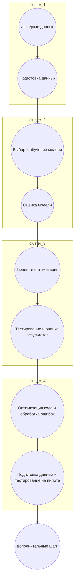

# ML System Design Doc - [RU]
## MVP - "Идентификация личности по походке и смежным факторам поведенческой биометрии" 

------------------------------------------------------------------------------------------------    
### 1. Цели и предпосылки 
#### 1.1. Зачем идем в разработку продукта?  

1. **Бизнес-цель Product Owner**: увеличение прибыли, расширение рынка, улучшение удовлетворенности клиенто, обеспечение конкурентного преимущества на рынке.
2. **Улучшение от использования ML Product Owner & Data Scientist**: Машинное обучение может помочь автоматизировать процессы аутентификации пользователей.
5. **Успех итерации с точки зрения бизнеса Product Owner**: увеичение количества верно идентифицированых личностей.
------------------------------------------------------------------------------------------------
#### 1.2. Бизнес-требования и ограничения  ####

- **Краткое описание БТ и ссылки на детальные документы с бизнес-требованиями** `Product Owner`
  - Бизнес-требования для данного проекта включают в себя разработку и внедрение системы идентификации личности на основе поведенческих биометрических данных, таких как походка и другие факторы поведения. Детальные бизнес-требования предоставлены Product Owner'ом в документе [ссылка на документ с бизнес-требованиями].

- **Бизнес-ограничения** `Product Owner`
  - Product Owner также предоставил список бизнес-ограничений, который включает в себя бюджетные ограничения, сроки реализации, конфиденциальность данных и законодательные требования. Детальное описание ограничений можно найти в документе [ссылка на документ с бизнес-ограничениями].

- **Ожидания от конкретной итерации** `Product Owner`
  - Product Owner ожидает, что на первой итерации проекта будет реализован прототип системы, способный собирать и анализировать данные по походке и поведенческой биометрии. Этот прототип должен демонстрировать базовую функциональность и потенциал для идентификации личности.

- **Описание бизнес-процесса пилота, насколько это возможно - как именно мы будем использовать модель в существующем бизнес-процессе?** `Product Owner`
  - В рамках пилотного проекта, модель идентификации личности будет интегрирована в существующий процесс аутентификации. Пользователи будут приглашены пройти регистрацию и запись данных о своей походке и поведении. После этого, при последующей аутентификации, система будет сравнивать данные пользователя с ранее записанными данными, чтобы подтвердить личность.

- **Что считаем успешным пилотом? Критерии успеха и возможные пути развития проекта** `Product Owner`
  - Product Owner определил следующие критерии успеха для пилотного проекта:
    - Увеличение скорости аутентификации по сравнению с существующими методами.
    - Высокий уровень безопасности и защиты данных.
  - В случае успешной реализации пилота, возможны следующие пути развития проекта:
    - Расширение функциональности для учета других поведенческих биометрических данных.
    - Интеграция с дополнительными системами и приложениями.
    - Масштабирование проекта на более широкую аудиторию и рынок.
------------------------------------------------------------------------------------------------
## 1.3. Что входит в скоуп проекта/итерации, что не входит

### Входит в скоуп проекта/итерации:

- **На закрытие каких БТ подписываемся в данной итерации** `Data Scientist`:
  - В данной итерации `Data Scientist` подписывается на закрытие следующих бизнес-требований (БТ):
    - БТ1: Разработка алгоритма сбора данных о поведении и походке пользователей.
    - БТ2: Реализация базовой модели идентификации личности на основе собранных данных.

- **Описание результата с точки зрения качества кода и воспроизводимости решения** `Data Scientist`:
  - Ожидается, что код, разработанный `Data Scientist`, будет высокого качества, с хорошей документацией и комментариями для обеспечения читаемости и понимания другими разработчиками. Решение должно быть воспроизводимым, с возможностью повторного обучения модели на новых данных.

### Не входит в скоуп проекта/итерации:

- **Что не будет закрыто** `Data Scientist`:
  - В данной итерации не будут закрыты следующие аспекты:
    - БТ3: Интеграция модели в существующую систему аутентификации.
    - БТ4: Развертывание и масштабирование решения на боевых серверах.

- **Описание планируемого технического долга (что оставляем для дальнейшей продуктивизации)** `Data Scientist`:
  - Для дальнейшей продуктивизации проекта остается следующий технический долг:
    - БТ3: Интеграция модели в существующую систему аутентификации.
    - БТ4: Оптимизация производительности модели для реального времени.
    - БТ5: Тестирование на большом объеме данных и анализ точности идентификации.
    - БТ6: Развертывание и масштабирование решения на боевых серверах.
 -----------------------------------------------------------------------------------------------
## 1.4. Предпосылки решения

1. **Используемые блоки данных**:
   - Для идентификации личности по походке и поведенческой биометрии будут использованы данные, собранные от пользователей в рамках регистрации и аутентификации в системе. Эти данные включают информацию о походке, ритме шагов, скорости движения и другие параметры, которые можно извлечь из сенсорных устройств или камер на устройствах пользователя.

2. **Горизонт прогноза**:
   - Горизонт прогноза в данной системе ограничен моментом аутентификации пользователя. То есть, в момент аутентификации происходит сравнение данных пользователя с ранее собранными данными для проверки личности.

3. **Особенности аппаратного и программного обеспечения**:
   - Для сбора данных о поведении пользователей и аутентификации необходимо наличие сенсорных устройств или камер на устройствах пользователей. 

4. **Запрос бизнеса и обоснование**:
   - Запрос на разработку системы идентификации личности на основе поведенческой биометрии обоснован необходимостью повышения безопасности аутентификации пользователей. Это позволит улучшить защиту данных и предотвратить несанкционированный доступ.

5. **Законодательные ограничения**:
   - При разработке и внедрении системы идентификации личности будут учитываться законодательные ограничения, связанные с защитой личных данных и правами пользователей.
------------------------------------------------------------------------------------------------
## 2.1. Постановка задачи

### Цель проекта: `Data Scientist`

Разработать систему идентификации личности на основе поведенческой биометрии, такой как походка, в рамках MVP проекта "Идентификация личности по походке и смежным факторам поведенческой биометрии."

### Задачи:

1. **Сбор данных о поведении и походке пользователей**:
   - Разработать механизм сбора данных о поведении и походке пользователей с помощью сенсорных устройств или камер на устройствах пользователя.

2. **Предобработка данных**:
   - Провести предобработку собранных данных, включая очистку, масштабирование и преобразование данных в удобный формат для обучения модели.

3. **Обучение базовой модели идентификации личности**:
   - Разработать и обучить базовую модель, способную идентифицировать личность пользователя на основе собранных данных.

4. **Тестирование и оценка точности модели**:
   - Провести тестирование модели на отложенной выборке данных и оценить ее точность и эффективность.

5. **Документация и планирование будущих итераций**:
   - Подготовить документацию по проекту, включая инструкции по использованию системы и план развития проекта для будущих итераций.
------------------------------------------------------------------------------------------------
#### 2.2. Блок-схема решения  

########################################################################
#### 2.3. Этапы решения задачи `Data Scientist`  

- Для каждого этапа **по результатам EDA** описываем - **отдельно для бейзлайна** и **отдельно для основного MVP** - все про данные и технику решения максимально конкретно. Обозначаем необходимые вводные, технику предполагаемого решения и что ожидаем получить на выходе, чтобы перейти к следующему этапу.  
- Как правило, детальное и структурированное заполнение раздела `2.3` возможно только **по результатам EDA**.  
- Если описание в дизайн доке **шаблонно** - т.е. его можно скопировать и применить к разным продуктам, то оно **некорректно**. Дизайн док должен показывать схему решения для конкретной задачи, поставленной в части 1.  
    
> Примеры этапов:  
> - Этап 2 - Подготовка прогнозных моделей  
> - Этап 3 - Интерпретация моделей (согл. с заказчиком)  
> - Этап 4 - Интеграция бизнес правил для расчета бизнес-метрик качества мрдели  
> - Этап 5 - Подготовка инференса модели по итерациям    
> - Этап 6 - Интеграция бизнес правил  
> - Этап 7 - Разработка оптимизатора (выбор оптимальной итерации)  
> - Этап 8 - Подготовка финального отчета для бизнеса  

*Этап 1 - это обычно, подготовка данных.*  

В этом этапе должно быть следующее:  

- Данные и сущности, на которых будет обучаться ваша модель машинного обучения. Отдельная таблица для целевой переменной (либо целевых переменных разных этапов), отдельная таблица – для признаков.  
  
| Название данных  | Есть ли данные в компании (если да, название источника/витрин) | Требуемый ресурс для получения данных (какие роли нужны) | Проверено ли качество данных (да, нет) |
| ------------- | ------------- | ------------- | ------------- |
| Продажи | DATAMARTS_SALES_PER_DAY  | DE/DS | + |
| ...  | ...  | ... | ... |
 
- Краткое описание результата этапа - что должно быть на выходе: витрины данных, потоки данных, др.  
  
> Чаще всего заполнение раздела невозможно без EDA.

 *Этапы 2 и далее, помимо подготовки данных.*
 
Описание техники **для каждого этапа** должно включать описание **отдельно для MVP** и **отдельно для бейзлайна**:  

- Описание формирования выборки для обучения, тестирования и валидации. Выбор репрезентативных данных для экспериментов, обучения и подготовки пилота (от бизнес-цели и репрезентативности данных с технической точки зрения) `Data Scientist`    
- Горизонт, гранулярность, частоту необходимого пересчета прогнозных моделей `Data Scientist`   
- Определение целевой переменной, согласованное с бизнесом `Data Scientist`   
- Какие метрики качества используем и почему они связаны с бизнес-результатом, обозначенным `Product Owner` в разделах `1` и `3`. Пример - WAPE <= 50% для > 80% категорий, bias ~ 0. Возможна формулировка в терминах относительно бейзлайна, количественно. Для бейзлайна могут быть свои целевые метрики, а может их вообще не быть (если это обосновано) `Data Scientist`   
- Необходимый результат этапа. Например, необходимым результатом может быть не просто достижение каких-либо метрик качества, а включение в модели определенных факторов (флаг промо для прогноза выручки, др.) `Data Scientist`    
- Какие могут быть риски и что планируем с этим делать. Например, необходимый для модели фактор (флаг промо) окажется незначимым для большинства моделей. Или для 50% моделей будет недостаточно данных для оценки `Data Scientist`    
- Верхнеуровневые принципы и обоснования для: feature engineering, подбора алгоритма решения, техники кросс-валидации, интерпретации результата (если применимо).  
- Предусмотрена ли бизнес-проверка результата этапа и как будет проводиться `Data Scientist` & `Product Owner`  
  
### 3. Подготовка пилота  
  
#### 3.1. Способ оценки пилота  
  
- Краткое описание предполагаемого дизайна и способа оценки пилота `Product Owner`, `Data Scientist` with `AB Group` 
  
#### 3.2. Что считаем успешным пилотом  
  
Формализованные в пилоте метрики оценки успешности `Product Owner`   
  
#### 3.3. Подготовка пилота  
  
- Что можем позволить себе, исходя из ожидаемых затрат на вычисления. Если исходно просчитать сложно, то описываем этап расчетов ожидаемой вычислительной сложности на эксперименте с бейзлайном. И предусматриваем уточнение параметров пилота и установку ограничений по вычислительной сложности моделей. `Data Scientist` 

### 4. Внедрение `для production систем, если требуется`    

> Заполнение раздела 4 требуется не для всех дизайн документов. В некоторых случаях результатом итерации может быть расчет каких-то значений, далее используемых в бизнес-процессе для пилота.  
  
#### 4.1. Архитектура решения   
  
- Блок схема и пояснения: сервисы, назначения, методы API `Data Scientist`  
  
#### 4.2. Описание инфраструктуры и масштабируемости 
  
- Какая инфраструктура выбрана и почему `Data Scientist` 
- Плюсы и минусы выбора `Data Scientist` 
- Почему финальный выбор лучше других альтернатив `Data Scientist` 
  
#### 4.3. Требования к работе системы  
  
- SLA, пропускная способность и задержка `Data Scientist`  
  
#### 4.4. Безопасность системы  
  
- Потенциальная уязвимость системы `Data Scientist`  
  
#### 4.5. Безопасность данных   
  
- Нет ли нарушений GDPR и других законов `Data Scientist`  
  
#### 4.6. Издержки  
  
- Расчетные издержки на работу системы в месяц `Data Scientist`  
  
#### 4.5. Integration points  
  
- Описание взаимодействия между сервисами (методы API и др.) `Data Scientist`  
  
#### 4.6. Риски  
  
- Описание рисков и неопределенностей, которые стоит предусмотреть `Data Scientist`   
    
